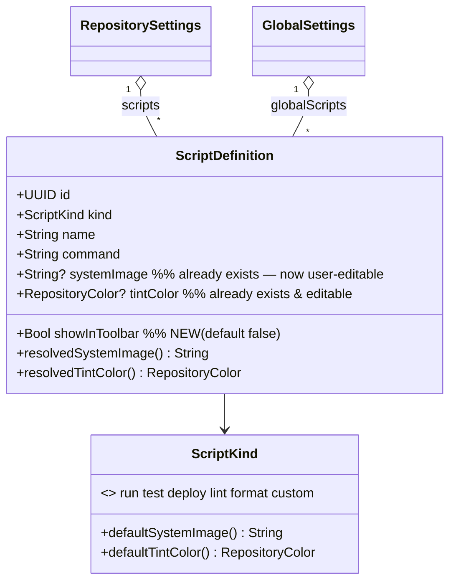

# ✨ Custom Script Icons & Pin-to-Toolbar

Let users pick a **custom SF Symbol icon** for their custom scripts and **pin** selected
scripts to the main worktree toolbar as one-click icon buttons — the way
[Prowl](https://github.com/onevcat/Prowl) surfaces its "Custom Actions".

> **Design decisions confirmed with the user:**
> 1. **Explicit "Pin to toolbar" toggle** per script (not Prowl's auto-surface-all). The existing `ScriptMenu` dropdown stays as the catch-all / overflow.
> 2. **Prowl-style icon picker**: curated preset grid + free-text SF Symbol field + "Open SF Symbols" launcher. No third-party dependency.
> 3. **Both repo *and* global** scripts get the icon + pin. A pinned *global* script appears on **every** repository's toolbar.

## Enhancement Summary

**Deepened on:** 2026-07-03 · **Research agents used:** SwiftUI/toolbar expert (`swiftui-expert-skill` + `swiftui-code-review`), `code-simplicity-reviewer`, `best-practices-researcher` (SF Symbols + macOS 26 toolbar), `swift-testing-expert`.

### Key corrections applied
1. **Pinned buttons need NO `.id()` cache-busting.** The original plan copied `ScriptMenu`'s `.id(scriptMenuIdentity)` trick. That trick exists only because **`NSMenu` caches item state** — a plain toolbar `Button` does not. Native SwiftUI observation already refreshes it: `makeToolbarState` rebuilds a fresh value-type `WorktreeToolbarState` every `detailBody` pass, and `Image.tintedSymbol(...)` returns a new `Image(nsImage:)` each call. Adding `isRunning` to an `.id()` would *destroy and recreate* the button on every Run↔Stop toggle (flicker, no in-place transition). → **Default: no `.id()`. Phase-4-gated fallback: an icon+tint-only `.id()` if (and only if) live testing shows staleness.**
2. **Dropped `showInToolbar` from `ScriptFingerprint`.** It is not the pin-refresh mechanism (the `ForEach(pinnedScripts)` structural diff is). `scriptMenuIdentity` governs only the `ScriptMenu` NSMenu, which renders nothing pin-dependent. Adding it there is wasted invalidation.
3. **Toolbar logic must be testable.** `WorktreeToolbarState`/`ScriptFingerprint` are `fileprivate` nested types in `WorktreeDetailView` — a test target can't name them. → All pin logic lives in the **public `[ScriptDefinition].pinnedToolbarScripts(limit:)`** helper (fully unit-tested); `WorktreeToolbarState.pinnedScripts` is a one-line forwarder. This also settles "is the single-use helper justified?" — yes, it's the public seam.
4. **Fewer files, more reuse.** Inline `ScriptSymbolPresets` into the picker file (Feature module, not Shared); colocate `PinnedScriptToolbarButton` next to `ScriptMenu` in `WorktreeDetailView.swift` so it shares the existing `scriptButtonHelp`/tinted-label helpers instead of re-implementing them; fold new tests into existing suites.

### New considerations discovered
- No public runtime SF-Symbol enumeration API exists — a **curated static list is the correct, production-safe approach** (optional `com.apple.CoreGlyphs` plist enrichment is private/fragile; deferred).
- `NSImage(systemSymbolName:accessibilityDescription:) == nil` is the reliable **symbol-validity check**; surface a non-blocking hint.
- Launching **SF Symbols.app** via `com.apple.SFSymbols` needs **no `LSApplicationQueriesSchemes`** (iOS-only) and **no sandbox temporary-exception**; web fallback needs no network entitlement.
- The `NSImage.SymbolConfiguration(paletteColors:)` menu/toolbar tint workaround (already in `Image.tintedSymbol`) is **still required on macOS 26** — SwiftUI `.foregroundStyle` is stripped in AppKit menu contexts.
- Give each pinned button a **titled `Label` + `.labelStyle(.iconOnly)`** so the macOS narrow-window overflow chevron and VoiceOver stay legible (don't render a bare `Image`).

---

## Overview

The good news: **most of the model already exists.** `ScriptDefinition`
(`SupacodeSettingsShared/Models/ScriptDefinition.swift`) already carries
`systemImage: String?` and `tintColor: RepositoryColor?`, already resolves them via
`resolvedSystemImage` / `resolvedTintColor`, and every render surface (toolbar `ScriptMenu`,
command palette, settings headers) already reads those resolved values through
`Image.tintedSymbol(_:color:)`. **Nothing writes `systemImage` today** — custom scripts
always fall back to `ScriptKind.custom.defaultSystemImage` (`"text.alignleft"`).

So the feature is three focused additions:

| # | Gap today | What we add |
|---|-----------|-------------|
| A | No UI ever sets `systemImage` | A **Prowl-style SF Symbol picker** wired into both script settings panes, next to the existing `ColorSwatchRow`. |
| B | No "pinned" concept; the toolbar shows scripts only as **one** `ScriptMenu` dropdown | A persisted **`showInToolbar: Bool`** flag + a **Toggle** in settings + **individual pinned `ToolbarItem` buttons** in `WorktreeToolbarContent`. |
| C | — | Route pin logic through a **public, testable** helper; rely on native SwiftUI observation for toolbar refresh. |

The tint color is already user-editable via `ColorSwatchRow`, so this plan does **not** touch color beyond reusing it in the picker row.

## How Prowl does it (reference)

Prowl is a sibling of this codebase (same `supacode.xcodeproj` lineage). Its `UserCustomCommand`:

- Stores the icon as a **raw SF Symbol `String`** with a `resolvedSystemImage` fallback of `"terminal"`.
- Icon picker = a `.popover` with: a `TextField("SF Symbol name")`, a `LazyVGrid` of ~31 curated `Image(systemName:)` preset buttons, and an **"Open SF Symbols"** button that launches `com.apple.SFSymbols` via `NSWorkspace` (fallback: `https://developer.apple.com/sf-symbols/`).
- Auto-surfaces **all** commands on the toolbar: first 3 inline (`prefix(3)`) + an overflow `chevron.down` popover (`dropFirst(3)`), each button → `.runCustomCommand(index)`.

We copy the **icon picker verbatim** and adapt the toolbar surfacing to an **explicit pin toggle** (per the user's choice) rather than auto-surface.

---

## Current-state map (files this touches)

**Model / persistence**
- `SupacodeSettingsShared/Models/ScriptDefinition.swift` — `systemImage`/`tintColor` already present (L14-15); lossy decode (L57-65); `CodingKeys` (L52); `[ScriptDefinition].merged(repo:global:)` (L90-96), `.primaryScript` (L80).
- `SupacodeSettingsShared/Models/ScriptKind.swift` — `defaultSystemImage` (L27), `defaultTintColor` (L39).
- `SupacodeSettingsShared/Models/RepositorySettings.swift` — `var scripts: [ScriptDefinition]` (L11); lossy decode + legacy `runScript` migration (L88-92).
- `SupacodeSettingsShared/Models/GlobalSettings.swift` — `var globalScripts` (L57); decode forces `kind = .custom` per load (L294-303) — **must preserve `showInToolbar` + `systemImage`**.

**Settings UI + reducers**
- `SupacodeSettingsFeature/Views/GlobalScriptsSettingsView.swift` — per-script `Section`: `TextField("Name")` + `LabeledContent("Color") { ColorSwatchRow(...) }` (L48-51). Icon row + pin toggle go here.
- `SupacodeSettingsFeature/Views/RepositoryScriptsSettingsView.swift` — same for `.custom` (L51-77); predefined kinds only show the command editor.
- `SupacodeSettingsFeature/Views/ColorSwatchRow.swift` — reusable swatch picker (reuse; `SwatchSelectionRing` is the selected-affordance idiom to mirror).
- `SupacodeSettingsShared/Support/TintedSymbol.swift` — `Image.tintedSymbol(_:color:)` (reuse; note it auto-appends `.fill` when a filled variant exists, L28).
- `SupacodeSettingsFeature/Reducer/SettingsFeature.swift` — `BindingReducer()` (L221) + `case .binding: return persist(state)` (L318-320). **Binding edits already persist.**
- `SupacodeSettingsFeature/Reducer/RepositorySettingsFeature.swift` — `BindingReducer()` (L96) + `case .binding: persistAndNotify` (L234-239). **Same.**

**Toolbar**
- `supacode/Features/Repositories/Views/WorktreeDetailView.swift` — `WorktreeToolbarContent: ToolbarContent` (L494), `WorktreeToolbarState` (L401), `ScriptFingerprint`/`scriptMenuIdentity` (L385-464), `ScriptMenu` + `scriptButtons`/`scriptButtonHelp`/`scriptLabel` (L1082-1188). Pinned buttons + the new `PinnedScriptToolbarButton` slot in here.
- `supacode/Features/App/Reducer/AppFeature.swift` — `repoScripts`/`globalScripts` synced from settings (L478, L858); `.runNamedScript` (L715) / `.stopScript` run path; `resolveScript(id:)` (L102). **No new actions needed** — pinned buttons reuse `onRunNamedScript` / `onStopScript`.

---

## Data model change (ERD)



`showInToolbar` defaults to `false` so **no existing script auto-appears** after upgrade — pinning is strictly opt-in.

---

## Technical approach — phases

### Phase 1 — Model, persistence & the testable helper (foundation)

**`SupacodeSettingsShared/Models/ScriptDefinition.swift`**
- Add stored property `public var showInToolbar: Bool` (default `false`).
- Add `.showInToolbar` to `CodingKeys` (encode stays compiler-synthesized — a custom `init(from:)` does **not** suppress `encode(to:)` synthesis).
- In `init(from:)`, decode defensively so old data & corrupt values collapse to `false` (the `try?` is load-bearing — a plain `decodeIfPresent` would throw on a bad value and drop the whole script via `Lossy`):
  ```swift
  showInToolbar = (try? container.decodeIfPresent(Bool.self, forKey: .showInToolbar)) ?? false
  ```
- Add `showInToolbar: Bool = false` to the memberwise `init(...)`.

**Public, testable pin helper** — extension on `[ScriptDefinition]` (a `static`/instance method, no free functions per CLAUDE.md). **This is the single home for all pin ordering/cap logic** so it is unit-testable (the toolbar types that consume it are `fileprivate`):
```swift
/// Scripts pinned to the toolbar, in the receiver's order, capped to `limit`.
/// Call on the already-`merged` array (repo-first) so repo pins precede global pins.
/// Blank-command pins are KEPT (rendered disabled) — the user explicitly pinned them.
func pinnedToolbarScripts(limit: Int) -> [ScriptDefinition] {
  Array(filter(\.showInToolbar).prefix(limit))
}
```

**`SupacodeSettingsShared/Models/GlobalSettings.swift`**
- Confirm the decode normalization loop (L295-303) that forces `kind = .custom` **preserves** `showInToolbar` and `systemImage` (it mutates only `kind`/empty `name`, so it already does) — lock it with a test (Phase-1 tests).

> **Research insight (simplicity + testing):** keep this helper even though `pinnedScripts` is its only caller — it is the *public seam* that makes the behavior testable (the consumer `WorktreeToolbarState` is `fileprivate`). Test the helper once; make `pinnedScripts` a one-line forwarder and do **not** re-test the same transform.

**`ScriptSymbolPresets`** — the curated ~30-symbol list is defined as a nested caseless `enum` **inside** `ScriptSymbolPicker.swift` (Phase 2), in the Feature module. It is not its own Shared file (single-use, nothing in Shared references it). Symbols (mirror Prowl): `terminal`, `terminal.fill`, `play.fill`, `stop.fill`, `hammer.fill`, `shippingbox.fill`, `doc.text.fill`, `sparkles`, `bolt.fill`, `flame.fill`, `wand.and.stars`, `wrench.and.screwdriver.fill`, `checkmark.circle.fill`, `xmark.circle.fill`, `exclamationmark.triangle.fill`, `ladybug.fill`, `clock.fill`, `repeat`, `arrow.clockwise`, `folder.fill`, `archivebox.fill`, `paperplane.fill`, `cloud.fill`, `tray.and.arrow.down.fill`, `tray.and.arrow.up.fill`, `icloud.and.arrow.up.fill`, `square.and.arrow.up.fill`, `arrow.triangle.2.circlepath`, `folder.badge.plus`, `doc.badge.plus`.

**Tests** — fold into existing `supacodeTests/RepositorySettingsScriptTests.swift` (Swift Testing, bare `@Test func`). See the **Testing** section for exact cases: `showInToolbar` round-trip / missing-key→false / malformed→false; `systemImage` round-trip / malformed→nil; `GlobalSettings` preserves both while forcing `.custom`; `pinnedToolbarScripts(limit:)` order/cap/merge-dedupe/blank-command.

---

### Phase 2 — Settings UI: icon picker + pin toggle

**`SupacodeSettingsFeature/Views/ScriptSymbolPicker.swift`** *(new)* — the reusable Prowl-style picker, `struct ScriptSymbolPickerRow: View` bound to `@Binding var systemImage: String?` + `let tint: RepositoryColor` (value, read-only, for the preview).

- **Trigger:** a `LabeledContent("Icon")` whose trailing content is a `Button` (never `onTapGesture`) showing `Image.tintedSymbol(resolvedName, color: tint.nsColor)`; `@State private var isPresented` opens a `.popover`. **No Liquid Glass** — Settings Forms are system-styled; keep system chrome.
- **Free-text field** with the standard nil⇄"" mapping (trim only the stored value):
  ```swift
  var freeTextBinding: Binding<String> {
    Binding(get: { systemImage ?? "" },
            set: { let t = $0.trimmingCharacters(in: .whitespacesAndNewlines)
                   systemImage = t.isEmpty ? nil : t })   // clear ⇒ nil ⇒ resolvedSystemImage fallback
  }
  ```
  (Per-keystroke persist, exactly like the existing `ScriptCommandEditor`; acceptable — debounce only if profiling flags it.)
- **Adaptive preset grid** (Dynamic-Type friendly — not hardcoded `.fixed(24)`×10), in a `ScrollView`:
  ```swift
  LazyVGrid(columns: [GridItem(.adaptive(minimum: 28), spacing: 8)], spacing: 8) {
    ForEach(ScriptSymbolPresets.all, id: \.self) { symbol in
      Button { systemImage = symbol; isPresented = false } label: {
        Image(systemName: symbol).imageScale(.large).frame(width: 28, height: 28)
      }
      .buttonStyle(.plain).contentShape(.rect)
      .background(symbol == systemImage ? Color.accentColor.opacity(0.18) : .clear, in: .rect(cornerRadius: 6))
      .accessibilityLabel(symbol)
      .accessibilityAddTraits(symbol == systemImage ? [.isSelected] : [])
      .help(symbol)
    }
  }
  ```
  Mirror `ColorSwatchRow`'s `SwatchSelectionRing` affordance for visual consistency with the adjacent Color row (extract it to a shared modifier or reimplement the same `.overlay { …stroke(.tint) }`).
- **Unknown-symbol hint** (non-blocking, system-colored):
  ```swift
  if let name = systemImage, NSImage(systemSymbolName: name, accessibilityDescription: nil) == nil {
    Label("Unknown symbol — it may not render.", systemImage: "exclamationmark.triangle")
      .font(.footnote).foregroundStyle(.secondary)
  }
  ```
- **"Open SF Symbols" launcher** (private method on the view, no free function; no `LSApplicationQueriesSchemes`, no entitlement):
  ```swift
  if let app = NSWorkspace.shared.urlForApplication(withBundleIdentifier: "com.apple.SFSymbols") {
    NSWorkspace.shared.openApplication(at: app, configuration: .init())
  } else if let url = URL(string: "https://developer.apple.com/sf-symbols/") {
    NSWorkspace.shared.open(url)
  }
  ```
- **Accessibility/tooltips:** `.help(...)` + `.accessibilityLabel("Icon: \(resolved)")` on the trailing preview button; `.accessibilityLabel(symbol)` per preset.

> **Research insight:** `Image.tintedSymbol` auto-appends `.fill` when a filled variant exists, so the preview may show a filled glyph while the stored raw name is the outline. This is consistent with every other render surface (toolbar/menu/header) — document it so it isn't mistaken for a bug.

**`SupacodeSettingsFeature/Views/GlobalScriptsSettingsView.swift`** — in the per-script `Section` (globals are always `.custom`), add above the Color row:
```swift
LabeledContent("Icon") { ScriptSymbolPickerRow(systemImage: $script.systemImage, tint: script.resolvedTintColor) }
```
and a pin toggle (all kinds):
```swift
Toggle("Show in toolbar", isOn: $script.showInToolbar)
  .help("Pin this script to the worktree toolbar as a one-click button.")
```

**`SupacodeSettingsFeature/Views/RepositoryScriptsSettingsView.swift`** — inside the `if script.kind == .custom { … }` block add the same **Icon** row next to `ColorSwatchRow` (L55-57); add the **"Show in toolbar"** `Toggle` for **every** user script section (custom *and* predefined), so a `.run`/`.test` script can also be pinned. Keep the existing `.id(script.id)` on each `Section`.

> **Binding hygiene (confirmed):** `$script.systemImage` / `$script.showInToolbar` are `BindingReducer`-backed projected bindings → `.binding(...)` → persist. **No new reducer actions.** The `store_state_mutation_in_views` lint does *not* fire (projected bindings are the sanctioned path). Removal must continue to go through `.removeGlobalScript(id)` / `.removeScript(id)` — never binding-mutate the array — so SwiftUI tears the row down before the element vanishes.

Tests: `TestStore` cases for toggling `showInToolbar` and editing `systemImage` via `.binding(.set(\.globalScripts, mutated))` / `.binding(.set(\.settings.scripts, mutated))` — see **Testing**.

---

### Phase 3 — Toolbar: pinned script buttons

**`supacode/Features/Repositories/Views/WorktreeDetailView.swift`**

1. `WorktreeToolbarState`: add a one-line forwarder + cap constant:
   ```swift
   static let maxPinnedToolbarButtons = 4
   var pinnedScripts: [ScriptDefinition] {
     allScripts.pinnedToolbarScripts(limit: Self.maxPinnedToolbarButtons)   // logic lives in the public helper
   }
   ```
   (`allScripts` = `.merged(repo:global:)`, so repo pins render before global pins, and `merged` already drops a global shadowed by a same-ID repo script. Extras beyond the cap remain reachable in the `ScriptMenu` dropdown.)

2. In `WorktreeToolbarContent.body`, insert a pinned group **between** the Open menu and the `ScriptMenu` (mirroring the existing `openMenu → ToolbarSpacer(.fixed) → ScriptMenu` rhythm):
   ```swift
   ToolbarSpacer(.fixed)
   ToolbarItemGroup {
     ForEach(toolbarState.pinnedScripts) { script in            // ForEach identity via ScriptDefinition: Identifiable
       PinnedScriptToolbarButton(
         script: script,
         isRunning: toolbarState.runningScriptIDs.contains(script.id),
         isFullScreen: isFullScreen,
         onRun: { onRunNamedScript(script) },
         onStop: { onStopScript(script) }
       )
     }
   }
   ```
   **No `.id()` on the buttons** (see correction below). `ToolbarItemGroup { ForEach { Button } }` is the right shape — the group keeps pins as one clustered slot that reflows in place; a stable string `id:` is **not** required because this is a plain `.toolbar { }`, not a customizable `.toolbar(id:)`.

3. **`PinnedScriptToolbarButton`** — colocate in `WorktreeDetailView.swift` next to `ScriptMenu` so it **shares** the existing private helpers instead of duplicating them. Extract `ScriptMenu.scriptButtonHelp` and the tinted run/stop `Label` into shared statics and reuse from both the menu row and the pinned button (prevents drift):
   ```swift
   Button {
     isRunning ? onStop() : onRun()
   } label: {
     Label { Text(script.displayName) } icon: {
       Image.tintedSymbol(isRunning ? "stop" : script.resolvedSystemImage, color: script.resolvedTintColor.nsColor)
     }
     .labelStyle(.iconOnly)   // icon-only in the bar; Text still feeds the overflow chevron + VoiceOver
   }
   .disabled(!isRunning && script.command.trimmingCharacters(in: .whitespacesAndNewlines).isEmpty)
   .help(sharedScriptHelp(script, isRunning: isRunning))          // mirrors scriptButtonHelp
   .toolbarTintColorScheme(manager: terminalManager, isFullScreen: isFullScreen)
   ```
   Pass **only the values it needs** (not the whole `toolbarState`) so diffing stays cheap. Blank-command pins render **disabled with a tooltip** (not hidden) — the user explicitly pinned them.

> **⚠️ Correction — do NOT add the `ScriptMenu` `.id()` trick here.** That workaround exists because **`NSMenu` caches item state**; a plain toolbar `Button` does not. Every flip already propagates via native observation: `makeToolbarState` builds a fresh `WorktreeToolbarState` each `detailBody` pass (Run↔Stop via `isRunning`, enable/disable via `.disabled`, icon/tint via a fresh `Image(nsImage:)` from `tintedSymbol`). An `.id()` containing `isRunning` would **tear down and rebuild** the button on every toggle — losing the in-place transition and risking a flash. **Default: no `.id()`.** *Only if* Phase-4 live testing proves a real staleness bug, add a narrow `.id()` keyed on **icon + tint only** (never `isRunning`/`isCommandBlank`), paired with `.transaction { $0.animation = nil }` like the other toolbar items.

> **⚠️ Correction — do NOT add `showInToolbar` to `ScriptFingerprint`.** Pins appear/disappear via the `ForEach(pinnedScripts)` structural diff, not via `scriptMenuIdentity` (which rebuilds only the `ScriptMenu` NSMenu, and that menu renders nothing pin-dependent). Leave `ScriptFingerprint` unchanged unless a future change renders a pin indicator *inside* the dropdown.

**Optional micro-perf:** `allScripts` (a `.merged` allocation) is recomputed by `pinnedScripts`, `visibleGlobalScripts`, `primaryScript`, and `scriptMenuIdentity` each pass. Arrays are tiny; if you touch it, compute once in `makeToolbarState` and store it on `WorktreeToolbarState`.

**Tests:** covered by the public `pinnedToolbarScripts(limit:)` helper tests (Phase 1). The live toolbar rendering / NSToolbar behavior is **manual-verify** (Phase 4) — see Testing §"Not unit-tested".

---

### Phase 4 — Polish, edge cases & verification

- Tooltips on every new control (CLAUDE.md); accessibility labels on picker swatches + pinned buttons; `.accessibilityHidden` on decorative header glyphs.
- Run `make format` && `make lint` && `make build-app` && `make test`.
- **Manual verification (`/run` or `make run-app`) — the load-bearing checks the unit layer can't make:**
  1. Pin a repo script and a global script → both appear as toolbar buttons; a pinned **global** shows across multiple repos.
  2. Toggle pin off → button disappears **without** a worktree switch.
  3. Run a pinned script → button flips to **stop in place** (no flash); stop it → flips back. *(If flicker/staleness appears, apply the Phase-3 icon/tint-only `.id()` fallback.)*
  4. Blank-command pin → button is **disabled** with the explanatory tooltip.
  5. Set a custom icon → renders identically in the pinned button, the `ScriptMenu`, the settings header, and the command palette; clearing the field reverts to the kind default.
  6. Narrow the window → pinned buttons collapse into the `»` overflow chevron with **legible titles** (confirms `.labelStyle(.iconOnly)` + retained `Text`).
  7. "Open SF Symbols" launches the app (or the web page if not installed).

---

## SpecFlow — edge cases & flows

- **Upgrade / first run:** `showInToolbar` absent → `false` everywhere → no surprise buttons. ✅
- **Downgrade caveat:** an older build drops the unknown `showInToolbar` (and a custom `.custom` `systemImage` if it predates that write) — pin state lost on downgrade. Same class as custom-hex tints (CLAUDE.md "Colors"). Document; ship no Sparkle downgrade path expecting pins to survive.
- **Pinned global vs repo collision:** `merged(repo:global:)` drops the shadowed global by ID → the repo copy wins, button renders once. Covered by a helper test.
- **Blank-command pinned script:** shown **disabled** with a tooltip (not hidden) — explicit pin ⇒ silent omission would confuse. (Contrast `visibleGlobalScripts`, which hides half-configured *unpinned* globals.)
- **More pins than the cap:** first `maxPinnedToolbarButtons` render as buttons; the rest stay in the `ScriptMenu` dropdown. A Prowl-style `chevron.down` overflow is deferred (out of scope).
- **Invalid SF Symbol string (typo):** `resolvedSystemImage` returns the typed string; `Image.tintedSymbol` falls back to `Image(systemName:)` (placeholder). Picker shows a non-blocking hint. Not fatal.
- **Predefined-kind icon:** icon picker offered for `.custom` only (predefined kinds resolve to `kind.defaultSystemImage` by design). Predefined kinds are still **pinnable**.
- **Redundancy with primary Run:** `ScriptMenu`'s single-click still runs the first `.run` script; pinning that same script gives two run affordances — acceptable, additive.
- **Running-state source:** pinned-button `isRunning` comes from the selected row's slice (`runningScriptIDs`, WorktreeDetailView L62) — same source as `ScriptMenu`; no new global observation.

---

## Acceptance criteria

**Icon customization**
- [ ] A user can open an icon picker on any **custom** repo or global script and choose an SF Symbol via (a) preset grid, (b) free-text field, or (c) after browsing in SF Symbols.app.
- [ ] The chosen icon renders (tinted) in: the settings header, the toolbar `ScriptMenu`, the command palette, and any pinned toolbar button.
- [ ] Clearing the field reverts to the kind default (`resolvedSystemImage`), never a blank icon. A typo shows a non-blocking "unknown symbol" hint.

**Pin to toolbar**
- [ ] Each script (repo + global) has a persisted "Show in toolbar" toggle, default off.
- [ ] Pinned scripts appear as individual, tinted, one-click toolbar buttons (up to the cap); the rest remain in the `ScriptMenu`.
- [ ] A pinned **global** script appears on **every** repository's toolbar.
- [ ] Clicking a pinned button runs the script; while running it shows a stop glyph and stops it (in-place). Blank-command pins are disabled with a tooltip.
- [ ] Toggling pin/icon updates the toolbar **without** a worktree switch.
- [ ] Overflow (narrow window) shows legible titled entries.

**Quality gates**
- [x] Unit tests for model Codable, settings-binding persistence, and `pinnedToolbarScripts` ordering/cap/dedupe all pass. *(82 tests, 6 suites — all green.)*
- [x] `make format`, `make lint`, `make build-app`, `make test` green.
- [ ] All 7 manual checks (Phase 4) pass. *(Pending live-app QA — see PR.)*

---

## Testing

Swift Testing (`@Test`/`#expect`, `#require`, `expectNoDifference`). Feature suites are `@MainActor struct` with `@Test(.dependencies)` + `TestStore`. Never `Task.sleep` — use `TestClock`/injected clock. **Fold into existing suites** (`RepositorySettingsScriptTests.swift`, `SettingsFeatureTests.swift`) rather than new files.

**Model (bare `@Test func`, in `RepositorySettingsScriptTests.swift`)**
- `showInToolbarRoundTrips` — encode/decode preserves `true`; whole-value `==`.
- `missingShowInToolbarKeyDecodesFalse` — JSON without the key → `false` (opt-in default).
- `malformedShowInToolbarCollapsesToFalseAndKeepsScript` — `"showInToolbar":"yes"` → `false`, `name`/`command` survive (pins the `try?` requirement).
- `systemImageRoundTrips` / `malformedSystemImageDropsOverrideNotScript` — `"systemImage":123` → `nil`, `resolvedSystemImage == ScriptKind.custom.defaultSystemImage`.
- `decodePreservesShowInToolbarAndSystemImageWhileForcingCustomKind` — extend `GlobalSettingsScriptsCodableTests` with a forged `"kind":"run"` + `showInToolbar:true` + `systemImage`; assert `kind == .custom` **and** both fields survive (`#require` the element first).
- `pinnedToolbarScripts(limit:)` — filters to pinned; preserves merged order (repo before global); respects cap; keeps blank-command; drops global shadowed by same-ID repo. (Pass a pre-`merged` array to mirror the call site.)

**Settings persistence (`TestStore`)** — binding key paths are **whole-array** `.set` (these are plain `[ScriptDefinition]`, not `IdentifiedArray`, so there is no `\.binding.globalScripts[id:]` form):
- `togglingGlobalShowInToolbarPersists` — `store.send(.binding(.set(\.globalScripts, [pinned])))` → `receive(\.delegate.settingsChanged)`; assert `@Shared(.settingsFile).global.globalScripts.first?.showInToolbar == true`.
- `editingGlobalSystemImagePersists` — same shape for `systemImage`.
- `togglingRepoShowInToolbarPersists` — on a **`.run`** script (also covers "predefined kinds are pinnable"); `.binding(.set(\.settings.scripts, [pinned]))` → `receive(\.delegate.settingsChanged)`; read back `@Shared(.repositorySettings(rootURL, host: nil))`. (Verify the shared-key `host` matches `persistAndNotify`; delegate-receive + `store.state` is an acceptable proxy if readback is awkward.)
- Use `store.exhaustivity = .off(showSkippedAssertions: false)` as the existing suites do.

**Not unit-tested (manual-verify, Phase 4) — and why**
- **Live toolbar rebuild / NSToolbar caching / `ToolbarItemGroup` / `.toolbarTintColorScheme`** — not observable from a `TestStore`; the top risk, routed to Phase-4 manual checks (Run↔Stop in-place, disabled tooltip, pinned-global-across-repos, overflow legibility).
- **`WorktreeToolbarState.pinnedScripts` / `ScriptFingerprint`** — `fileprivate` nested types; unreachable by `@testable import`. All behavior lives in the tested public helper. (Only promote `ScriptFingerprint` to `internal` for a direct test if you deem it worth the surface area — low ROI; it's a field-copy struct.)
- **`ScriptSymbolPicker` popover / `NSWorkspace` launch / free-text binding** — OS/UI side effects with no injected seam; the nil⇄"" mapping is trivial and indirectly covered by resolve tests. Verify visually.
- **`ScriptSymbolPresets.all` contents** — a static list; at most a non-empty/no-duplicates guard. Don't assert exact membership (cosmetic churn).

---

## Risks & mitigations

| Risk | Mitigation |
|------|-----------|
| Pinned toolbar `Button` shows stale Run/Stop or disabled state (AppKit item cache) | First rely on native observation (works — `toolbarState` rebuilt each pass). Phase-4 live check gates it; fallback = icon/tint-only `.id()` + `.transaction{ $0.animation = nil }`. **Not** an `isRunning`-based `.id()`. |
| Toolbar tests can't compile against `fileprivate` types | All pin logic in the public `pinnedToolbarScripts(limit:)` helper; test that. |
| Pin/`systemImage` lost on Sparkle downgrade | Documented caveat; matches custom-tint policy; no downgrade guarantees. |
| `GlobalSettings` `.custom` normalization wipes new fields | Test locks that `showInToolbar`/`systemImage` survive the `kind`-normalization loop. |
| Toolbar overcrowding | Hard cap `maxPinnedToolbarButtons`; overflow stays in the dropdown; titled `.iconOnly` labels keep the `»` overflow legible. |
| Invalid symbol string renders blank | `resolvedSystemImage` + `tintedSymbol` fallbacks; non-blocking picker hint. |
| Private SF-Symbol enumeration temptation | Use the curated static list; the `com.apple.CoreGlyphs` plist read is private/fragile — deferred, not shipped as source of truth. |

---

## References

**Internal (reuse / touch)**
- `SupacodeSettingsShared/Models/ScriptDefinition.swift:14` — existing `systemImage`/`tintColor`; `:52` CodingKeys; `:90` `merged`.
- `SupacodeSettingsShared/Models/GlobalSettings.swift:294` — global decode normalization.
- `SupacodeSettingsShared/Support/TintedSymbol.swift:13` — `Image.tintedSymbol` (`:28` auto-`.fill`).
- `SupacodeSettingsFeature/Views/GlobalScriptsSettingsView.swift:48` / `RepositoryScriptsSettingsView.swift:53` — where the icon row + toggle land.
- `SupacodeSettingsFeature/Views/ColorSwatchRow.swift:6` (`SwatchSelectionRing:130`) — reused tint picker + selection affordance.
- `SupacodeSettingsFeature/Reducer/SettingsFeature.swift:318` / `RepositorySettingsFeature.swift:234` — `.binding` → persist (no new actions).
- `supacode/Features/Repositories/Views/WorktreeDetailView.swift:385` (`ScriptFingerprint`), `:401` (`WorktreeToolbarState`), `:494` (`WorktreeToolbarContent`), `:1082`/`:1136` (`ScriptMenu`/`scriptButtons`/`scriptButtonHelp`).
- `supacode/Features/App/Reducer/AppFeature.swift:102` (`resolveScript`), `:478`/`:858` (script sync), `:715` (`runNamedScript`).
- Existing tests to extend: `supacodeTests/RepositorySettingsScriptTests.swift`, `supacodeTests/SettingsFeatureTests.swift`, `supacodeTests/AppFeatureRunScriptTests.swift`.

**External (from research)**
- Prowl — [onevcat/Prowl](https://github.com/onevcat/Prowl), `docs/components/custom-actions.md` (icon picker + toolbar surfacing patterns).
- SF Symbols: [no runtime enumeration API — Apple Forums 695321](https://developer.apple.com/forums/thread/695321); [tint stripped in menus — Forums 738716](https://developer.apple.com/forums/thread/738716); [SwiftUI Toolbar staleness — Forums 667107](https://developer.apple.com/forums/thread/667107); [NSImage.SymbolConfiguration](https://developer.apple.com/documentation/appkit/nsimage/symbolconfiguration); [WWDC21 SF Symbols in UIKit/AppKit](https://developer.apple.com/videos/play/wwdc2021/10251/).
- macOS 26 toolbars: [Swift with Majid — Glassifying toolbars (2025)](https://swiftwithmajid.com/2025/07/01/glassifying-toolbars-in-swiftui/); [WWDC25 session 323](https://developer.apple.com/videos/play/wwdc2025/323/); [toolbar(id:content:)](https://developer.apple.com/documentation/swiftui/view/toolbar(id:content:)).
- [Apple SF Symbols](https://developer.apple.com/sf-symbols/) — launcher fallback URL. Bundle id `com.apple.SFSymbols` verified.

**New files to create** *(net: 2 source + 0 new test files — tests fold into existing suites)*
- `SupacodeSettingsFeature/Views/ScriptSymbolPicker.swift` (contains the picker **and** the nested `ScriptSymbolPresets`).
- `PinnedScriptToolbarButton` — **colocated in** `supacode/Features/Repositories/Views/WorktreeDetailView.swift` next to `ScriptMenu` (shares its private helpers), not a standalone file.
